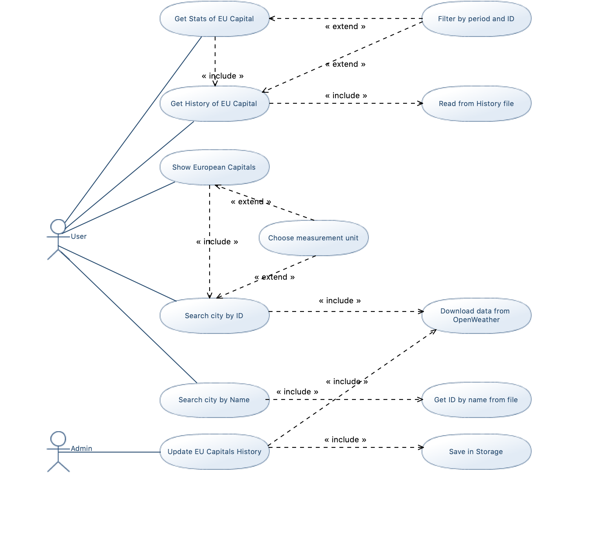
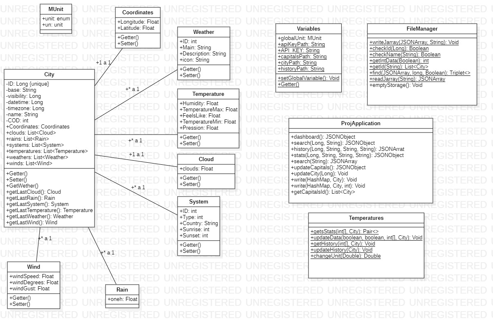

  

<h1>Meteo.Univpm</h1>

Meteo.Univpm è un servizio web per la visualizzazione delle condizioni meteo delle capitali d'europa più importanti. Questo servizio offre all'utente la possibilità di visualizzare contemporaneamente le condizioni meteo di tutte le principali capitali d'europa oppure di visualizzare solamente le condizioni meteo di una determinata città, cercandola attraverso il suo id. 
 Poichè spesso si hanno più città con lo stesso nome, all'interno del servizio è presente un motore di ricerca per ottenere l'id della città desiderata.
 L'utente ha poi la possibilità visualizzare lo storico dei dati delle capitali e di visualizzare le statistiche da esso derivanti nell'unità di misura da lui scelta, Celsius, Kelvin o Fahreneit. 
 Inoltre è possibile specificare il periodo di tempo di cui visualizzare lo storico o le statistiche.

Abbiamo realizzato un breve video che spiega il funzionamento dell'app: <a href="https://youtu.be/-NHd0RyF9n0" target="new">YouTube</a>

<h2>OpenWeather</h2>

Per accedere al meteo delle varie città e delle capitali europee abbiamo utilizzato il servizio messo a disposizione da OpenWeatherMap il quale rende disponibile agli sviluppatori delle api key gratuite, attraverso le quali si può andar a prendere i relativi dati meteo e restituirli all'utente.

<h2>Diagrammi UML</h2>
<ul>
  <li>
    <h3>Use-Case Diagram</h3>
   
  
Breve descrizione del diagramma

  </li>
  <li>
    <h3>Class Diagram</h3>
   
  
Breve descrizione del diagramma

  </li>
  <li>
    <h3>Sequence Diagram</h3>
   
  
Il sequence diagram rappresenta in modo ottimale tutte le azioni che l'utente può eseguire attraverso le relative rotte. 
   L'utente può, infatti, interagire solamente con la classe Proj.application, ovvero la classe principale del programma, che poi andrà a relazionarsi con le altre classi del programma.

  </li>
</ul>
 
<h2>Installazione</h2>

Procedura d'installazione, specificare che i percorsi sono relativi quindi funzionano, e che bisogna cambiare la key di OpenWeather

 
<h2>Istruzioni sull'uso</h2>

Chiaramente sarebbe stato molto difficile, quasi impossibile con un file locale, salvare nello storico i dati di tutte le città del mondo; infatti questo servizio web è stato creato per le condizioni meteo delle principali capitali europee, nello specifico ne abbiamo scelte 10. Ovviamente non è preclusa all'utente la possibilità di ottenere le condizioni meteo di una qualsiasi altra città, non per forza una capitale. Per quanto riguarda il filtraggio su base periodica, avendo iniziato a salvare i dati nello storico il giorno 19 Gennaio 2021, abbiamo preso il 19 Gennaio come giorno 0. Per inserire il periodo, l'utente dovrà inserire due interi: il primo specifica il giorno d'inizio (ricordando che il 19 Gennaio rappresenta il giorno 0), il secondo invece rappresenta la durata del periodo di cui si vuole ottenere lo storico o le statistiche, a seconda della rotta utilizzata.

  <code>
    <ul>
      <li>
        Rome: 3169070
      </li>
      <li>
        Paris: 2968815
      </li>
      <li>
        Madrid: 3117735
      </li>
      <li>
        Berlin: 2950158
      </li>
      <li>
        London: 2643743
      </li>
      <li>
        Amsterdam: 2759794
      </li>
      <li>
        Athens: 264371
      </li>
      <li>
        Lisbon: 2267057
      </li>
      <li>
        Luxembourg: 2960315
      </li>
      <li>
        Moscow: 524901
      </li>
    </ul>
  </code>

<h3>Meteo delle Capitali</h3>

La rotta <code>/</code> rappresenta la home directory, restituisce le condizioni meteo del giorno odierno delle 10 capitali europee che abbiamo scelto.

 
<h3>Motore di ricerca</h3>

La rotta <code>/getid</code> è un motore di ricerca che riceve dall'utente il nome di una città e restituisce un JSON array contente tutte le città con quel nome, ognuna con il proprio id e il paese in cui si trova.
 L'abbiamo inserita perchè nella maggior parte dei casi ci sono molte città con lo stesso nome e in questo modo l'utente può ottenere l'ID della città desiderata.

 
<h3>Meteo di una città tramite ID</h3>

La rotta <code>/search</code> serve all'utente per scegliere la città, in base all'ID, di cui visualizzare le condizioni meteo del giorno odierno. Dall'utente deve obbligatoriamente ricevere come parametro l'id della città di cui visualizzare lo condizioni meteo odierne. Inoltre l'utente può, facoltativamente, inserire come parametro l'unità di misura con cui visualizzare i dati, aggiungendo <code>u=k</code> per indicare il Kelvin, <code>u=f</code> per indicare il Fahreneit e <code>u=c</code> per indicare il Celsius. Se l'utente non aggiunge nulla, per default l'unità di misura di visualizzazione è il Celsius.

 
<h3>Storico del meteo di una capitale tramite ID</h3>

La rotta <code>/history</code> serve all'utente per ottenere i dati sulle condizioni meteo di una delle capitali europee, salvati nello storico. L'unico parametro che l'utente deve obbligatoriamente inserire è, anche qui, l'ID della città. 
 L'utente può poi, come in precedenza, aggiungere l'unità di misura desiderata e, inoltre, inserire il periodo di tempo di cui visualizzare i dati presenti nello storico, aggiungendo <code>beg= </code> per specificare il giorno di inizio, considerando, come già specificato, il 19 Gennaio come giorno 0, e <code>dur= </code> per specificare la durata del periodo. 
 Se l'utente non specifica il periodo di riferimento, per default il programma restituisce tutti i dati della città presenti nello storico dal giorno 0 al giorno precedente rispetto alla data odierna, poiché è possibile che i dati del giorno odierno non siano ancora stati aggiunti allo storico.

 
<h3>Statistiche dello storico di una capitale tramite ID</h3>

La rotta <code>/stats</code> serve all'utente per ottenere le statistiche di una delle capitali europee, relative ai dati salvati nello storico, ovvero la media delle temperature (temperatura registrata, temperatura massima, temperatura minima e temperatura percepita) e la varianza delle temperature registrate.
 Anche qui, l'utente deve, obbligatoriamente, inserire l'ID della città di cui vuole visualizzare le statistiche e può inserire l'unità di misura e il periodo di tempo desiderati. 
 Di default, e quindi se l'utente non aggiunge niente, l'unità di misura è il Celsius e il periodo va dal giorno 0 al giorno precedente alla data odierna.

 
<h3>Aggiornamento dello Storico</h3>

La rotta <code>/capitals</code> viene utilizzata dall'admin, in quanto metodo Post, per andare ad aggiornare i dati relativi alle capitali europee presenti nello storico. 
 Se, per il giorno odierno, sono già presenti i dati, e cioè è già presente un record con quel particolare <code>dt</code> (datetime), il programma non aggiungerà nulla allo storico. In questo modo, avremo sempre un solo record di ogni capitale per ogni giorno, in quanto il filtraggio avviene su base giornaliera.

 
<h2>Software utilizzati e Librerie esterne</h2>

<h3>Software</h3>
<ul>
  <li><b>Eclipse</b>: Eclipse è un ambiente di sviluppo integrato utilizzato nella programmazione di computer. Contiene un'area di lavoro di base e un sistema di plug-in estensibile per la personalizzazione dell'ambiente.
  </li>
  <li>
    <b>Postman</b>: Postman è una piattaforma di collaborazione per lo sviluppo di API. Le funzionalità di Postman semplificano ogni fase della creazione di un'API e ottimizzano la collaborazione in modo da poter creare API migliori, più velocemente.
  </li>
  <li>
    <b>umlDesigner</b>: UML Designer è uno strumento UML open source basato su Sirius ed Eclipse. Il progetto è concesso in licenza con EPL.
  </li>
  <li>
    <b>StarUML</b>: StarUML è uno strumento UML di MKLab. Il software è stato concesso in licenza con una versione modificata di GNU GPL fino al 2014, quando è stata rilasciata una versione riscritta 2.0.0 per il beta test con una licenza proprietaria. Dopo essere stato abbandonato per un po 'di tempo, il progetto ha avuto una ripresa per passare da Delphi a Java / Eclipse per poi fermarsi di nuovo.
  </li>
</ul>
<h3>Librerie</h3>
<ul>
  <li>
    <b>JSONSimple</b>: JSON.simple è un semplice toolkit Java per JSON. Puoi utilizzare JSON.simple per codificare o decodificare il testo JSON.
  </li>
  <li>
    <b>javatuples</b>: javatuples.javatuples è una delle librerie java più semplici mai realizzate. Il suo scopo è fornire un insieme di classi java che ti consentano di lavorare con le tuple.
  </li>
</ul>

 
<h2>Miglioramente futuri</h2>

Cosa potrebbe fare in futuro, per esempio salvare i dati di tutte le cittò in un db online

 
<h2>Sviluppatori</h2>
<table>
  <tr>
    <td>
      Nome 
    </td>
    <td>
      Mail 
    </td>
    <td>
      Contributo 
    </td>
  </tr>
  <tr>
    <td>
      Massimiliano Piccinini 
    </td>
    <td>
      s1092515@studenti.univpm.it 
    </td>
    <td>
      1/3 
    </td>
  </tr>
  <tr>
    <td>
      Michele Larocca 
    </td>
    <td>
      s1093531@studenti.univpm.it
    </td>
    <td>
      1/3 
    </td>
  </tr>
  <tr>
    <td>
      Edoardo Pantella 
    </td>
    <td>
      s1093665@studenti.univpm.it 
    </td>
    <td>
      1/3 
    </td>
  </tr>
</table>
